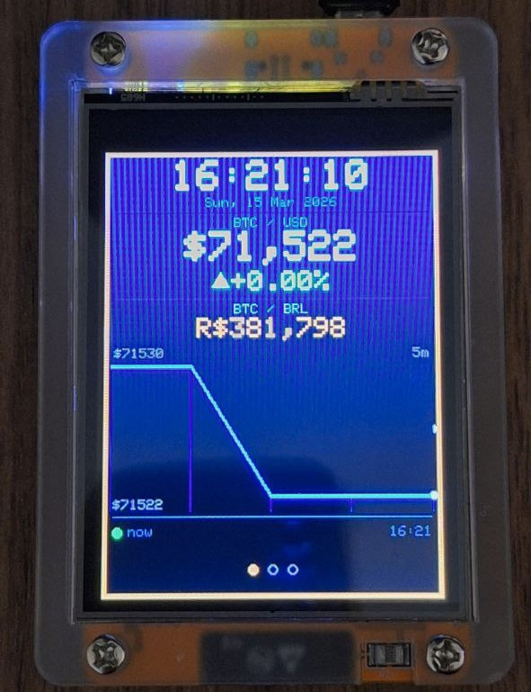

# BTC Price Monitor — ESP32 CYD

A real-time Bitcoin price tracker for the **ESP32-2432S028 (Cheap Yellow Display)** board. Shows BTC/USD, BTC/BRL, a 30-minute sparkline chart, and a live clock — all on the built-in 2.8" touchscreen.



---

## 🚀 Install now

For a simple install, access the [**Web Installer**](https://julianpedro.github.io/btc-price-monitor-cyd/) and follow the instructions.

**Attention**: For linux users, you will need give permission to access the USB port. You can do this by running the following command:

```sh
sudo chmod 666 /dev/ttyUSB0
``` 

---

## ✨ Features

- **Live prices** — BTC/Local Currency and USD/Local Currency fetched every 60 seconds (primary: AwesomeAPI, fallback: Coinbase)
- **BTC/BRL** — calculated directly from the two rates
- **30-minute sparkline** — ring-buffer history chart with min/max labels
- **Price change indicator** — colored ▲/▼ arrow with percentage since last reading
- **3 touch-navigable screens** — dashboard · details · clock
- **Wi-Fi setup via captive portal** — no hardcoded credentials; configure from your phone on first boot
- **Timezone & orientation via portal** — same captive portal lets you set UTC offset and portrait/landscape; changes are saved to flash and survive reboots
- **Re-open portal anytime** — hold the screen for 3 seconds at power-on to reconfigure without reflashing
- **Auto-brightness** — LDR ambient light sensor with EMA smoothing and gamma curve
- **RGB LED** — flashes green on price up, red on price down
- **Double-tap to sleep** — turns display off to save power; double-tap again to wake

---

## 🔧 Hardware

| Item | Details |
|---|---|
| Board | ESP32-2432S028R (CYD — Cheap Yellow Display) |
| Display | 2.8" ILI9341 TFT, 240 × 320, SPI |
| Touch | XPT2046, separate VSPI bus |
| Light sensor | LDR on GPIO 34 (ADC-only) |
| RGB LED | Active-LOW on GPIOs 4 / 16 / 17 |
| Backlight | PWM on GPIO 21 |

No extra wiring needed — everything is on the CYD board.

### 📌 Pin reference

| Function | GPIO |
|---|---|
| Backlight PWM | 21 |
| LDR | 34 |
| LED Red | 4 |
| LED Green | 16 |
| LED Blue | 17 |
| Touch CS | 33 |
| Touch IRQ | 36 |
| Touch SCK | 25 |
| Touch MISO | 39 |
| Touch MOSI | 32 |

---

## 📦 Software dependencies

Install all four via **Arduino Library Manager** (Sketch → Include Library → Manage Libraries):

| Library | Author |
|---|---|
| TFT_eSPI | Bodmer |
| XPT2046_Touchscreen | Paul Stoffregen |
| ArduinoJson ≥ 7.x | Benoit Blanchon |
| WiFiManager | tzapu |

---

## ⚙️ Setup

### 1. TFT_eSPI user configuration

TFT_eSPI requires a board-specific `User_Setup.h`. For the CYD (ESP32-2432S028), use the configuration for the **ILI9341** driver with the correct SPI pins. Many ready-made setups are available in the `User_Setups/` folder inside the TFT_eSPI library directory — look for one named `Setup_CYD` or `Setup_ESP32_2432S028`.

If you are using PlatformIO, you can point to your setup file via `build_flags` in `platformio.ini`.

### 2. Edit `config.h`

Open `config.h` and set your timezone. Everything else works out of the box.

```cpp
// Example: UTC-3 São Paulo / Brasília
#define TIMEZONE_OFFSET_SEC  (-3L * 3600L)
```

All available options are documented inside `config.h`.

### 3. Upload

Select board **ESP32 Dev Module** (or the CYD variant if available), choose the correct port, and upload.

### 4. First boot — Wi-Fi, timezone & orientation setup

On first power-on the device creates a Wi-Fi Access Point:

```
Network: BTC-Monitor
```

1. Connect to it from your phone or laptop
2. A captive portal opens automatically (or navigate to **192.168.4.1**)
3. Fill in your Wi-Fi network, password, **timezone** (e.g. `-3` for Brasília, `0` for London, `8` for Hong Kong), and **orientation** (`0` = portrait / standing up, `1` = landscape / lying flat)
4. Submit — the device saves everything to flash and restarts

On all subsequent boots it reconnects and applies the saved settings.

### 🔄 Reconfiguring after first boot

Hold the touchscreen for **3 seconds** during the "Connecting..." splash screen at any power-on. The portal opens again, letting you change Wi-Fi, timezone, or orientation without reflashing.

> **Changing orientation** (`0` ↔ `1`) restarts the device automatically and switches between the portrait layout (single-column with large sparkline) and the landscape layout (two-column: prices on the left, sparkline on the right).

---

## 👆 Usage

| Gesture | Action |
|---|---|
| Single tap | Cycle to next screen |
| Double tap | Toggle display on / off |
| Hold 3 s at power-on | Open configuration portal (Wi-Fi / timezone / orientation) |

### 🖥️ Screens

**Screen 1 — Dashboard**

```
┌────────────────────────┐
│       14:32:07         │
│  Sun, 15 Mar 2026      │
├────────────────────────┤
│      BTC / USD         │
│    $71,432.00          │
│    ▲  +1.24%           │
├────────────────────────┤
│      BTC / BRL         │
│   R$380.834,00         │
│  ╱╲___╱╲  ╱╲___        │  ← sparkline 30 min
├────────────────────────┤
│ USD/BRL  R$5,33        │
│ ● now            14:32 │
└────────────────────────┘
```

**Screen 2 — Details**
All prices, previous reading, percentage change, and last-update timestamp.

**Screen 3 — Clock**
Large clock with date and a small BTC/USD footer.

---

## 🛠️ Configuration reference (`config.h`)

| Constant | Default | Description |
|---|---|---|
| `TIMEZONE_OFFSET_SEC` | `-4 × 3600` | Default UTC offset (used only on first flash; after that, portal value wins) |
| `DST_OFFSET_SEC` | `0` | Daylight saving offset |
| `WIFI_AP_NAME` | `"BTC-Monitor"` | AP name shown during first-boot setup |
| `WIFI_AP_PASS` | `""` | AP password (empty = open network) |
| `WIFI_PORTAL_TIMEOUT_SEC` | `300` | Seconds before portal closes and device runs offline |
| `PRICE_REFRESH_MS` | `60000` | Price update interval in milliseconds |
| `SPARKLINE_POINTS` | `30` | History depth (30 pts × 60 s = 30 min) |
| `LED_BRIGHTNESS` | `48` | Rainbow LED brightness (0–255) |
| `BL_MIN` / `BL_MAX` | `15` / `255` | Backlight PWM range |
| `LDR_RAW_DARK` | `3800` | ADC reading in darkness (for calibration) |
| `LDR_RAW_LIGHT` | `300` | ADC reading under bright light (for calibration) |

### 💡 LDR calibration tip

Open the Serial Monitor at 115200 baud after flashing. The sketch prints the raw LDR value every 80 ms. Cover the sensor (dark) and note the value → set as `LDR_RAW_DARK`. Shine a light at it → set as `LDR_RAW_LIGHT`.

---

## 📂 Project structure

```
btc-monitor-cyd/
├── ycd-btc.ino   # Main sketch
└── config.h      # User configuration
```

---

## 🤝 Contributing

Issues and pull requests are welcome. If you adapt this to a different board or display size, the main constants to update are the `L_*` layout defines at the top of `ycd-btc.ino` and the TFT_eSPI `User_Setup.h`.

---

## Support This Project ⚡

If you find this project useful or just want to say thanks, consider sending a tip over the **Bitcoin Lightning Network**. Every sat counts!

| | |
|---|---|
| ⚡ **Lightning Address** | `stripedtailor30@walletofsatoshi.com` |

---

## 📄 License

MIT — see [LICENSE](LICENSE) for details.
