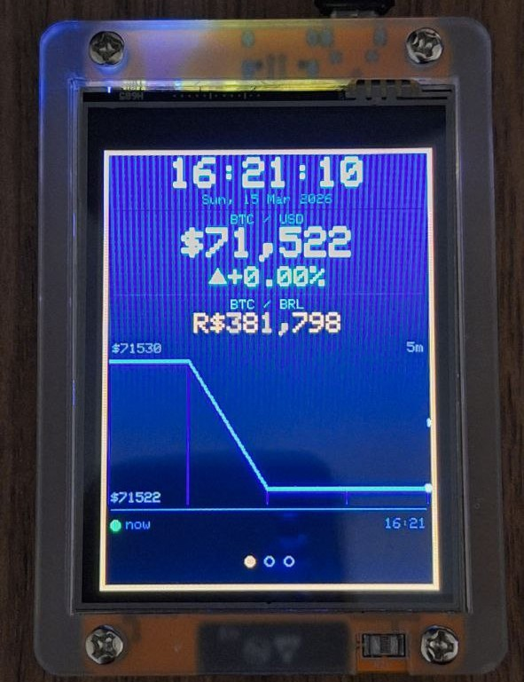

# BTC Price Monitor — ESP32 CYD

A real-time Bitcoin dashboard for the **ESP32-2432S028 (Cheap Yellow Display)** board. Seven touch-navigable screens cover price, network health, the halving countdown, mempool fees, a watch-only address, Fear & Greed / genesis trivia, and Lightning Network stats — all on the built-in 2.8" touchscreen, with an RGB LED that reacts to price moves, new blocks, fee spikes and Fear & Greed extremes.



---

## 🚀 Install now

For a simple install, access the [**Web Installer**](https://julianpedro.github.io/btc-price-monitor-cyd/) and follow the instructions.

**Attention**: For linux users, you will need give permission to access the USB port. You can do this by running the following command:

```sh
sudo chmod 666 /dev/ttyUSB0
``` 

---

## ✨ Features

- **7 touch-navigable screens** — Price · Network · Halving · Fees · Address · Clock · Lightning Network
- **Live prices** — BTC/Local Currency and BTC/USD fetched every 60 seconds (primary: AwesomeAPI, fallback: Coinbase), with a 30-minute sparkline (filled area chart, min/max labels, distance-from-window-high context)
- **Network stats** — block height, hashrate (derived from difficulty), difficulty retarget progress, last-block age, session high/low
- **Halving countdown** — blocks and estimated days remaining, current epoch progress, 21M supply progress bar
- **Mempool fees** — 4 fee tiers (next block / 30 min / 1 hour / economy) as color-coded bars, plus sats-per-dollar
- **Watch-only address** — track any Bitcoin address's confirmed balance (BTC, sats, and fiat equivalent) and unconfirmed mempool delta
- **Fear & Greed + Genesis** — large clock, current F&G index with color coding, and days since the genesis block
- **Lightning Network** — total public network capacity, channel count, node count, average channel size, tor/clearnet node split (via mempool.space)
- **Configurable mempool backend** — defaults to the public `mempool.space`; point it at your own node's mempool instance (e.g. `192.168.1.50:4081`) instead, no reflash needed
- **Configurable HTTP User-Agent** — sent on every API request, editable from the portal
- **Auto-cycle screens** — optionally advance screens automatically every N seconds instead of only on tap
- **Wi-Fi setup via captive portal** — no hardcoded credentials; a password-protected AP you open with a deliberate gesture (touch-hold 3 s at boot, or BOOT-hold 2 s anytime) rather than one that appears automatically on every Wi-Fi hiccup, and it closes itself once you save
- **Timezone, orientation, currency, watch address, mempool host, User-Agent & auto-cycle — all via the same portal**, persisted to flash and applied without reflashing
- **Auto-brightness** — LDR ambient light sensor with EMA smoothing and gamma curve
- **RGB LED events** — breathes green/red on price up/down (10 s); white double-blink on a new block; amber blink on a mempool fee spike; blue/purple pulse when Fear & Greed enters an extreme zone; quick R→G→B self-test flash at boot so you can tell hardware issues from logic issues
- **Wi-Fi signal bars** — 4-bar RSSI indicator in the footer instead of a plain connected/disconnected dot
- **Double-tap to sleep** — turns display off to save power; double-tap again to wake

---

## 🔧 Hardware

| Item | Details |
|---|---|
| Board | ESP32-2432S028R (CYD — Cheap Yellow Display) |
| Display | 2.8" ILI9341 TFT, 240 × 320, SPI |
| Touch | XPT2046, separate VSPI bus |
| Light sensor | LDR on GPIO 34 (ADC-only) |
| RGB LED | Active-LOW on GPIOs 4 / 16 / 17 |
| Backlight | PWM on GPIO 21 |

No extra wiring needed — everything is on the CYD board.

> Some CYD board revisions route GPIO16/17 to onboard PSRAM instead of a free GPIO. If the RGB LED never lights — not even the boot self-test flash — that's the likely cause, not the sketch's logic.

### 📌 Pin reference

| Function | GPIO |
|---|---|
| Backlight PWM | 21 |
| LDR | 34 |
| LED Red | 4 |
| LED Green | 16 |
| LED Blue | 17 |
| Touch CS | 33 |
| Touch IRQ | 36 |
| Touch SCK | 25 |
| Touch MISO | 39 |
| Touch MOSI | 32 |

---

## 📦 Software dependencies

Install all four via **Arduino Library Manager** (Sketch → Include Library → Manage Libraries):

| Library | Author |
|---|---|
| TFT_eSPI | Bodmer |
| XPT2046_Touchscreen | Paul Stoffregen |
| ArduinoJson ≥ 7.x | Benoit Blanchon |
| WiFiManager | tzapu |

---

## ⚙️ Setup

### 1. TFT_eSPI user configuration

TFT_eSPI requires a board-specific `User_Setup.h`. For the CYD (ESP32-2432S028), use the configuration for the **ILI9341** driver with the correct SPI pins. Many ready-made setups are available in the `User_Setups/` folder inside the TFT_eSPI library directory — look for one named `Setup_CYD` or `Setup_ESP32_2432S028`.

If you are using PlatformIO, you can point to your setup file via `build_flags` in `platformio.ini`.

### 2. Edit `config.h`

Open `config.h` and set your timezone. Everything else works out of the box — refresh intervals, the default mempool backend, User-Agent, LED thresholds and auto-cycle are all pre-set to sane defaults and documented inline.

```cpp
// Example: UTC-3 São Paulo / Brasília
#define TIMEZONE_OFFSET_SEC  (-3L * 3600L)
```

All available options are documented inside `config.h`.

### 3. Upload

Select board **ESP32 Dev Module** (or the CYD variant if available), choose the correct port, and upload.

### 4. First boot — Wi-Fi & settings setup

On first power-on the device shows a "Connecting to Wi-Fi..." splash and briefly tries to connect (it has nothing saved yet, so this fails fast). **Hold the touchscreen for 3 seconds** during that splash to open the setup portal — the device does *not* open it on its own, by design (see "Security notes" further down).

Once opened, the device creates a Wi-Fi Access Point:

```
Network: BTC-Monitor
Password: btcmonitor   (default — see below)
```

1. Connect to it from your phone or laptop, using the AP password from `config.h` (`WIFI_AP_PASS`, `btcmonitor` by default — **change it** before you rely on this device, it's shown here in the docs)
2. A captive portal opens automatically (or navigate to **192.168.4.1**)
3. Fill in your Wi-Fi network and password, plus:
   - **Timezone** (e.g. `-3` for Brasília, `0` for London, `8` for Hong Kong)
   - **Orientation** (`0` = portrait / standing up, `1` = landscape / lying flat)
   - **Currency** (e.g. `BRL`, `EUR`, `JPY`)
   - **Watch address** — a Bitcoin address to track on the Address screen (leave blank to disable — see the privacy note below before using this on the public backend)
   - **Mempool host** — `mempool.space` by default, or your own node's mempool instance (e.g. `192.168.1.50:4081`)
   - **HTTP User-Agent** — sent on every API request
   - **Auto-cycle seconds** — `0` to disable, or a number of seconds between automatic screen changes
4. Submit — the device saves everything to flash and restarts

On all subsequent boots it reconnects and applies the saved settings.

### 🔄 Reconfiguring after first boot

Hold the touchscreen for **3 seconds** during the "Connecting..." splash screen at any power-on, or hold the **BOOT button for 2 seconds** at any time during normal operation. The portal opens again, letting you change any of the settings above without reflashing — and closes itself automatically once you hit Save.

If your Wi-Fi is temporarily down (router reboot, outage), the device now just runs offline and retries on the next boot — it will **not** open the unattended setup AP for you automatically. This is intentional; see below.

> **Changing orientation** (`0` ↔ `1`) restarts the device automatically and switches between the portrait layout (single-column) and the landscape layout (two-column, price screen only — other screens reuse the same layout in both orientations).

---

## 🔒 Security notes

- **Setup AP has a password.** `WIFI_AP_PASS` defaults to `btcmonitor` in `config.h` (empty = open network, not recommended) — change it to your own before flashing. While the portal is open, it's a plaintext HTTP page on that AP, so anyone connected during setup can see the Wi-Fi credentials you type in; keep the setup window short and don't leave the portal open unattended.
- **The portal only opens on an explicit gesture** — touch-hold 3 s at boot, or BOOT-hold 2 s during normal operation. It does not reopen automatically if Wi-Fi drops, so the device doesn't end up unexpectedly broadcasting an open configuration AP after an outage.
- **TLS certificates aren't validated** (`setInsecure()`) on any HTTPS request this sketch makes, including to your own node if you configure it with `https://`. This is a deliberate trade-off for a $10 board with no cert store to manage — it protects against passive eavesdropping but not an active man-in-the-middle on your network. Point the mempool backend at your own node if you want to reduce reliance on public APIs.
- **HTTP response bodies are capped** at `HTTP_MAX_BODY_BYTES` (32 KB by default) regardless of what any server claims, so a misbehaving or malicious backend can't exhaust the device's heap.
- **Privacy — watch address:** the Address screen polls `GET /api/address/<your address>` on whatever mempool backend is configured, on every refresh (5 min by default). Using the public `mempool.space`, this tells its operator (and anyone observing that traffic) "this IP is watching this Bitcoin address," repeatedly and predictably. If that matters to you, point the **Mempool host** setting at your own node instead — see below.

---

## 👆 Usage

### Touch gestures

| Gesture | Action |
|---|---|
| Single tap | Cycle to next screen |
| Double tap | Toggle display on / off |
| Hold 3 s at power-on | Open configuration portal |

### BOOT button (back of board)

| Press | Action |
|---|---|
| Short press | Force immediate refresh of all data |
| Hold 2 s | Open configuration portal (same as touch hold at power-on) |

### 🖥️ Screens

Cycle through with a single tap, in this order:

| # | Screen | Shows |
|---|---|---|
| 1 | **Price** | Clock, date, BTC/USD, BTC/local currency, 30-min sparkline. Portrait is single-column; landscape splits into a price column and a chart column. |
| 2 | **Network** | Block height, hashrate, difficulty retarget progress, last-block age, session high/low. |
| 3 | **Halving** | Countdown (blocks + est. days), current epoch progress, 21M supply progress bar, current block reward. |
| 4 | **Fees** | Mempool fee tiers (next block / 30 min / 1 hour / economy) as color-coded bars, block height, sats-per-dollar. |
| 5 | **Address** | Watch-only address (truncated), confirmed balance in BTC/sats/fiat, unconfirmed mempool delta. Shows a placeholder if no address is configured. |
| 6 | **Clock** | Large clock, BTC/USD, sats/$, Fear & Greed index with color-coded gauge, days since the genesis block. |
| 7 | **Lightning** | Public network capacity (BTC), channel count, node count, average channel size, tor/clearnet node split. |

Every screen's footer shows: Wi-Fi signal bars (or a red dot if disconnected), how long ago the last successful update was, a "NODE" indicator with your configured host if you're not using the default `mempool.space`, the current time, and the page dots.

---

## 🛠️ Configuration reference (`config.h`)

| Constant | Default | Description |
|---|---|---|
| `TIMEZONE_OFFSET_SEC` | `-3 × 3600` | Default UTC offset (used only on first flash; after that, portal value wins) |
| `DST_OFFSET_SEC` | `0` | Daylight saving offset |
| `WIFI_AP_NAME` | `"BTC-Monitor"` | AP name shown during first-boot setup |
| `WIFI_AP_PASS` | `"btcmonitor"` | AP password for the setup portal — change this (empty = open network, not recommended) |
| `WIFI_PORTAL_TIMEOUT_SEC` | `300` | Seconds before portal closes and device runs offline |
| `PRICE_REFRESH_MS` | `60000` | Price update interval in milliseconds |
| `FEES_REFRESH_MS` | `120000` | Mempool fee tiers refresh interval |
| `NETWORK_REFRESH_MS` | `300000` | Block height / hashrate / difficulty refresh interval |
| `FNG_REFRESH_MS` | `600000` | Fear & Greed index refresh interval |
| `ADDR_REFRESH_MS` | `300000` | Watch-address balance refresh interval |
| `LN_REFRESH_MS` | `1800000` | Lightning Network stats refresh interval (mempool.space updates this ~daily) |
| `SPARKLINE_POINTS` | `30` | History depth (30 pts × 60 s = 30 min) |
| `DEFAULT_CURRENCY` | `"BRL"` | Initial comparison currency (changeable via portal) |
| `DEFAULT_MEMPOOL_HOST` | `"mempool.space"` | Initial mempool backend (changeable via portal) — see below |
| `DEFAULT_USER_AGENT` | `"btc-monitor-cyd/1.0"` | Initial HTTP User-Agent (changeable via portal) |
| `DEFAULT_AUTOCYCLE_SEC` | `0` | Initial auto-cycle interval, `0` = off (changeable via portal) |
| `LED_BRIGHTNESS` | `255` | Peak brightness for all LED effects (0–255) |
| `FEE_SPIKE_DELTA` | `5` | sat/vB jump in the fastest fee (between polls) that triggers the amber LED blink |
| `HTTP_MAX_BODY_BYTES` | `32768` | Hard cap on any single HTTP response body this sketch will read, regardless of what the server claims |
| `BL_MIN` / `BL_MAX` | `15` / `255` | Backlight PWM range |
| `LDR_RAW_DARK` | `3800` | ADC reading in darkness (for calibration) |
| `LDR_RAW_LIGHT` | `300` | ADC reading under bright light (for calibration) |

### 🌐 Using your own node instead of mempool.space

Set the **Mempool host** field in the portal to your node's mempool web UI address, e.g. `192.168.1.50:4081`. A bare `host:port` defaults to HTTPS, *unless* it's a private/LAN address (`10.x`, `192.168.x`, `172.16-31.x`, `127.x`, or `*.local`), which defaults to plain HTTP since a home node rarely has a valid TLS certificate. Prefix it with `https://` or `http://` explicitly to override the guess either way. This affects fees, block/hashrate/difficulty data, and the watch-address lookup — Lightning stats and price still come from their own dedicated APIs.

### 💡 LDR calibration tip

To calibrate, temporarily add `Serial.printf("[LDR] %d\n", raw);` inside `ldrUpdate()` and open the Serial Monitor at 115200 baud. Cover the sensor completely and note the value → set as `LDR_RAW_DARK`. Shine a light directly at it → set as `LDR_RAW_LIGHT`. Remove the print before the final build.

---

## 📂 Project structure

```
btc-monitor-cyd/
├── ycd-btc.ino   # Main sketch
└── config.h      # User configuration
```

---

## 🤝 Contributing

Issues and pull requests are welcome. If you adapt this to a different board or display size, the main constants to update are the `L_*` / `LL_*` layout defines at the top of `ycd-btc.ino` and the TFT_eSPI `User_Setup.h`.

---

## Support This Project ⚡

If you find this project useful or just want to say thanks, consider sending a tip over the **Bitcoin Lightning Network**. Every sat counts!

| | |
|---|---|
| ⚡ **Lightning Address** | `stripedtailor30@walletofsatoshi.com` |

---

## 📄 License

MIT — see [LICENSE](LICENSE) for details.
